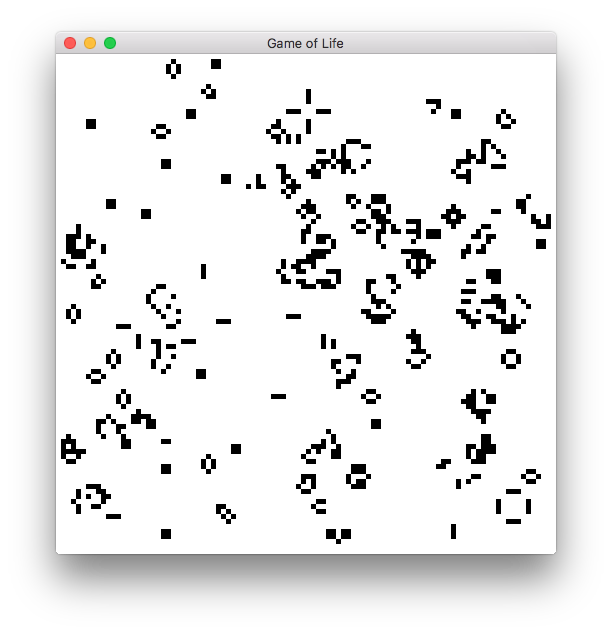

# Game of Life [](https://travis-ci.org/splintah/game-of-life)

A Game of Life emulation, both in a graphical window and in your terminal, with support for several file formats.



## File support

This program supports the following file formats:

- [Life 1.06 file](http://www.conwaylife.com/wiki/Life_1.06)
- [Life 1.05 file](http://www.conwaylife.com/wiki/Life_1.05)
- [Run Length Encoded file](http://www.conwaylife.com/wiki/Run_Length_Encoded)
- [Plaintext file](http://www.conwaylife.com/wiki/Plaintext)

You can find a lot of patterns, and their files, on the [LifeWiki](http://www.conwaylife.com/wiki).
There is a list of patterns [here](http://www.conwaylife.com/wiki/Category:Patterns).
To use a file, pass it to the `--file` flag (see [below](#usage) for more flags).

## Installation

[Install Rust](https://www.rust-lang.org/en-US/). Then run the following in your terminal:

```bash
# Install from GitHub with cargo.
cargo install --git https://github.com/splintah/game-of-life
```

This will install `game-of-life-window` and `game-of-life-cli` into `$HOME/.cargo/bin/`, which should be in your `PATH` variable when you have installed Rust via [`rustup`](https://rustup.rs).

## Installation from source

[Install Rust](https://www.rust-lang.org/en-US/). Then run the following in your terminal:

```bash
# Clone the code.
git clone https://github.com/splintah/game-of-life.git
# Change your directory to `game-of-life`.
cd game-of-life
# Install the binaries.
cargo install
```

## Usage

### Window

```text
game-of-life 0.3.0
Splinter Suidman
game-of-life emulates John Conway's game of life.
Press Escape to exit, press Space or a mouse button to reinitialise grid.

USAGE:
    game-of-life-window [OPTIONS]

FLAGS:
        --help       Prints help information
    -V, --version    Prints version information

OPTIONS:
        --background <background>    Change the background colour.
                                     The colour should be passed as a hexidecimal RGB colour, example: FFFFFF for white,
                                     000000 for black.
                                     Default: FFFFFF.
    -c, --cell-width <cell-width>    Change width of a cell (in pixels).
                                     Default: 10.
    -l, --chance <chance>            Chance for randomly initialising board.
                                     Example: with '--chance 128' passed, cells will have a 50% chance of living.
                                     Default: 220.
    -f, --file <file>                The file that contains the board.
                                     If this flag is passed, the board will be initialised with the board in the given
                                     file.
                                     Default: None.
        --foreground <foreground>    Change the foreground colour of the cells.
                                     The colour should be passed as a hexidecimal RGB colour, example: FFFFFF for white,
                                     000000 for black.
                                     Default: 000000.
        --fps <fps>                  The amount of updates and frames that should be performed per second.
                                     This is the maximum frames per second; that is, the actual fps could be less.
                                     Default: 24.
    -h, --height <height>            Change the height of the board (in cells).
                                     Default: 50.
    -w, --width <width>              Change the width of the board (in cells).
                                     Default: 50.
```

### CLI

```text
game-of-life 0.3.0
Splinter Suidman
game-of-life emulates John Conway's game of life.
Press ^C to quit.

USAGE:
    game-of-life-cli [OPTIONS]

FLAGS:
        --help       Prints help information
    -V, --version    Prints version information

OPTIONS:
    -l, --chance <chance>    Chance for randomly initialising board.
                             Example: with '--chance 128' passed, cells will have a 50% chance of living.
                             Default: 220.
    -f, --file <file>        The file that contains the board.
                             If this flag is passed, the board will be initialised with the board in the given file.
                             Default: None.
    -h, --height <height>    Change the height of the board (in cells).
                             Default: terminal height.
        --sleep <sleep>      The amount of milliseconds the thread sleeps between every frame.
                             Default: 0.
    -w, --width <width>      Change the width of the board (in cells).
                             Default: terminal width.
```
